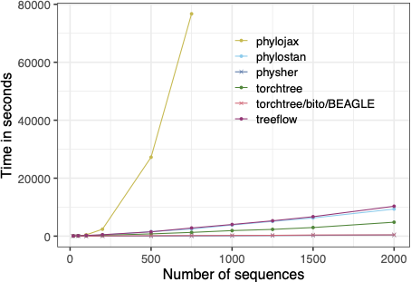
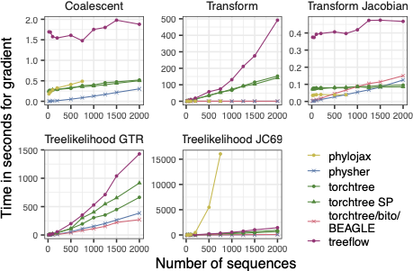

Benchmark
=========

The `torchtree` software was evaluated alongside other phylogenetic tools in a published `benchmark study <https://github.com/4ment/gradient-benchmark>`_ [#Fourment2022]_.

This benchmark assesses the memory usage and speed of various gradient implementations for phylogenetic models, including tree likelihood and coalescent models.
The study's aim was to compare the efficiency of automatic differentiation (AD) and analytic gradient methods.
The gradient of the tree likelihood can be computed by `BITO <https://github.com/phylovi/bito>`_ or `physher <https://github.com/4ment/physher>`_ [#Fourment2014]_, efficient C++ and C libraries that analytically calculate the gradient.
`torchtree` integrates with these libraries through the `torchtree-bito <https://github.com/4ment/torchtree-bito>`_ and `torchtree-physher <https://github.com/4ment/torchtree-physher>`_ plug-ins.
`physher` is a standalone program that can be used as a library by torchtree.

.. list-table:: Programs compared in the benchmark
   :header-rows: 1

   * - Program
     - Language
     - Framework
     - Gradient
     - Libraries
   * - `physher <https://github.com/4ment/physher>`_
     - C
     -
     - analytic
     -
   * - `phylostan <https://github.com/4ment/phylostan>`_ [#Fourment2019]_
     - Stan
     - Stan
     - AD
     -
   * - `phylojax <https://github.com/4ment/phylojax>`_
     - python
     - JAX
     - AD
     -
   * - `torchtree <https://github.com/4ment/torchtree>`_
     - python
     - PyTorch
     - AD
     - BITO and physher
   * - `treeflow <https://github.com/christiaanjs/treeflow>`_ [#swanepoel2022]_
     - python
     - TensorFlow
     - AD
     -

In this study, we compared six gradient implementations of the phylogenetic likelihood functions, in isolation and also as part of a variational inference procedure.
The data consisted of a collection of influenza A datasets ranging from 20 to 2000 sequences sampled from 2011 to 2013.

This macrobenchmark simulates the core steps of a real phylogenetic inference algorithm but simplifies the model to make it easier to implement across different frameworks.
In this setup, we are estimating parameters of time tree under a strict clock with a constant-size coalescent model.
Each implementation relies on automatic differentiation variational inference (ADVI) to maximize the evidence lower bound (ELBO) over 5,000 iterations.
We specify an exponential prior (mean = 0.001) on the substitution rate and the Jeffrey's prior for the unknown population size.

   
   Speed of implementations for 5,000 iterations of variational time-tree inference with a strict clock.

As shown in the next figure, the relative performance of AD depends on the task.

   Speed of implementations for the gradient of various tasks needed for inference.

.. [#Fourment2022] Fourment M, Swanepoel CJ, Galloway JG, Ji X, Gangavarapu K, Suchard MA, Matsen IV FA. Automatic differentiation is no panacea for phylogenetic gradient computation. *Genome Biology and Evolution*, 2023. doi:`10.1093/gbe/evad099 <https://doi.org/10.1093/gbe/evad099>`_ `arXiv:2211.02168 <https://arxiv.org/abs/2211.02168>`_

.. [#Fourment2014] Fourment M and Holmes EC. Novel non-parametric models to estimate evolutionary rates and divergence times from heterochronous sequence data. *BMC Evolutionary Biology*, 2014. doi:`10.1186/s12862-014-0163-6 <https://doi.org/10.1186/s12862-014-0163-6>`_

.. [#Fourment2019] Fourment M and Darling AE. Evaluating probabilistic programming and fast variational Bayesian inference in phylogenetics. *PeerJ*, 2019. doi:`10.7717/peerj.8272 <https://doi.org/10.7717/peerj.8272>`_

.. [#swanepoel2022] Swanepoel C, Fourment M, Ji X, Nasif H, Suchard MA, Matsen IV FA, Drummond A. TreeFlow: probabilistic programming and automatic differentiation for phylogenetics, 2022. `arXiv:2211.05220 <https://arxiv.org/abs/2211.05220>`_
