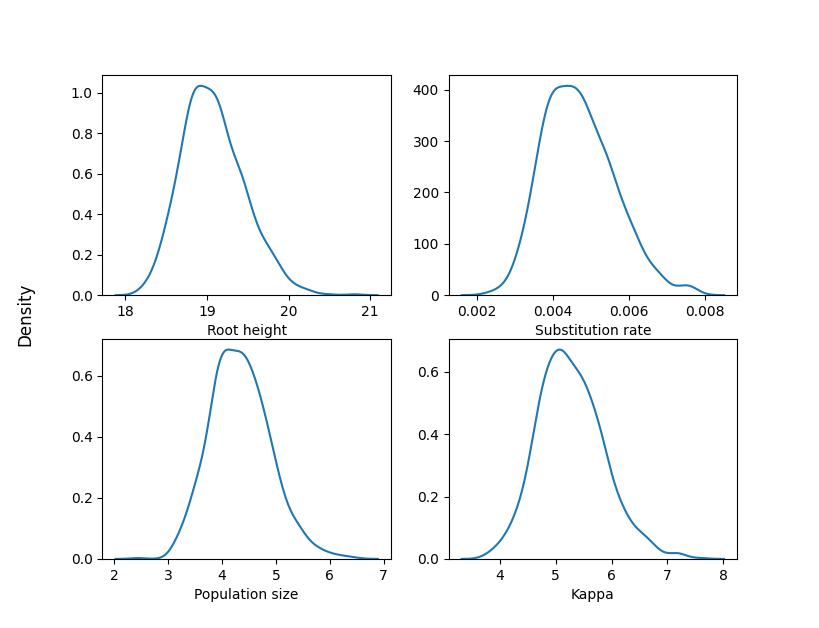

Quick start
===========

:command:`torchtree` requires a JSON file containing models and algorithms.
A configuration file can be generated using :command:`torchtree-cli`, a command line-based tool.
This two-step process allows the user to adjust values in the configuration file, such as hyperparameters.

:command:`torchtree-cli` implements several subcommands, each corresponding to a different type of inference algorithm.
A list of available subcommands can be obtained by running ``torchtree-cli --help``.

The following subcommands are available:

* :command:`advi`: Automatic differentiation variational inference
* :command:`hmc`: Hamiltonian Monte Carlo
* :command:`map`: Maximum *a posteriori*
* :command:`mcmc`: Markov chain Monte Carlo

Each subcommand/algorithm requires a different set of arguments which can be obtained by running ``torchtree-cli <subcommand> --help``.

:command:`torchtree-cli` requires an alignment file in FASTA format and a tree file in either `Newick <https://en.wikipedia.org/wiki/Newick_format>`_ or `NEXUS <https://en.wikipedia.org/wiki/Nexus_file>`_ format.
While *torchtree* uses the `DendroPy <https://jeetsukumaran.github.io/DendroPy/>`_ library to parse and manipulate phylogenetic trees, it is recommended to use a Newick file due to the numerous variations of the NEXUS format.

Let's explore a few examples of how to use these programs using an influenza A virus dataset containing 69 DNA sequences.
The alignment and tree files are located in the `data <https://github.com/4ment/torchtree/tree/master/data>`_ directory of the `torchtree <https://github.com/4ment/torchtree>`_ repository.

1 - Generating a configuration file
-----------------------------------

Unrooted tree with GTR+W4 model
~~~~~~~~~~~~~~~~~~~~~~~~~~~~~~~

We are going to generate a JSON file containing an unrooted tree model with a GTR substitution model.
Rate heterogeneity across sites is modelled using a discretized Weibull distribution with 4 rates categories.
This is similar to the more commonly used discretized Gamma distribution site model but the Weibull distribution has the advantage to be easily differentiable.

.. code-block:: bash

    torchtree-cli advi -i fluA.fa -t fluA.tree -m GTR -C 4 > fluA-advi-unrooted.json

By default, the priors are:

* Exponential prior on the branch lengths with a mean of 0.1.
* Flat Dirichlet priors on the rate biases and equilibrium state frequencies of the GTR model.
* Exponential prior on the shape parameter of the Weibull distribution with a mean of 0.5.

Time tree with strict clock and constant coalescent model
~~~~~~~~~~~~~~~~~~~~~~~~~~~~~~~~~~~~~~~~~~~~~~~~~~~~~~~~~

The following command generates a JSON file containing a time tree model with a strict molecular clock and a constant coalescent prior.
There is no rate heterogeneity across sites and the substitution model is the Hasegawa-Kishino-Yano model (HKY).

.. code-block:: bash

    torchtree-cli advi -i fluA.fa -t fluA.tree -m HKY --clock strict --coalescent constant > fluA-advi-rooted.json

By default, the remaining priors are:

* Proper CTMC reference prior for the substitution rate parameter.
* The prior density of the population size parameter :math:`\theta` of the constant coalescent model is :math:`1/\theta`.
* Flat Dirichlet prior on the equilibrium state frequencies of the HKY model.
* Lognormal prior on the kappa parameter (ratio of transition and transversion rates) of the HKY model with location 1.0 and scale 1.25.

Inferring the model parameters using HMC can be done by replacing the ``advi`` subcommand with ``hmc`` in the previous command:

.. code-block:: bash

    torchtree-cli hmc -i fluA.fa -t fluA.tree -m HKY --clock strict --coalescent constant --stem fluA-hmc-rooted > fluA-hmc-rooted.json

2 - Running torchtree
---------------------

Once we are happy with the configuration file and adjusted the prior distributions, we can run the inference algorithm using the following command:

.. code-block:: bash

    torchtree fluA-advi-rooted.json

torchtree will generate ``sample.csv`` and ``sample.trees`` files containing parameter and tree samples drawn from the variational distribution.
The ``sample.csv`` is compatible with `Tracer <https://beast.community/tracer>`_ and the trees in ``sample.trees`` can be summarized with `treeannotator <https://beast.community/treeannotator>`_ from the BEAST package.

Plotting the results
--------------------

Here are the kernel density estimates of the posterior distributions for some parameters:

.. toggle:: Show code

    .. code-block:: python

        import matplotlib.pyplot as plt
        import pandas as pd
        import seaborn as sns

        df = pd.read_csv("samples.csv", sep="\t")
        df.rename(
            columns={
                "tree.root_height": "Root height",
                "branchmodel.rate": "Substitution rate",
                "coalescent.theta": "Population size",
                "substmodel.kappa": "Kappa",
            },
            inplace=True,
        )

        fig, axes = plt.subplots(2, 2)
        fig.supylabel("Density")

        columns = ["Root height", "Substitution rate", "Population size", "Kappa"]
        for ax, col in zip(axes.flat, columns):
            sns.kdeplot(data=df, x=col, ax=ax)
            ax.set(ylabel=None)

        plt.show()

